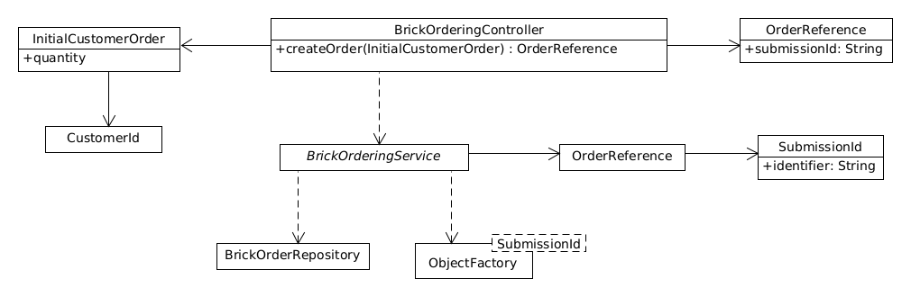

# bricks

Simple Brick Ordering System

SpringBoot / Maven project

    mvn install
    cd target

Run App on port 8080

    java -jar bricks-0.0.1-SNAPSHOT.jar

## Start an order

    POST: http://localhost:8080/bricks/start-order

with body:

    {
      "customerId": "paul",
      "quantity": 20
    }

Returns:

    {
      "submissionId": "9465ce12-0337-450c-b902-e9c0bad89d7f"
    }

## Get an order

    GET: http://localhost:8080/bricks/find-order/<submission ID>

## Class diagram for initial create order / find order use case

